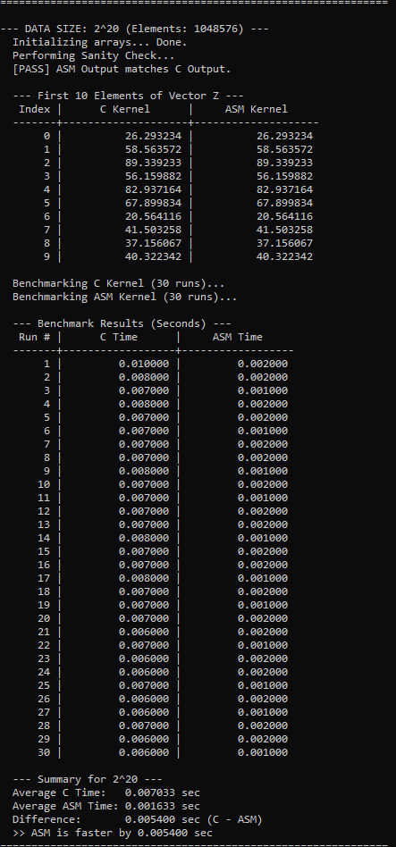
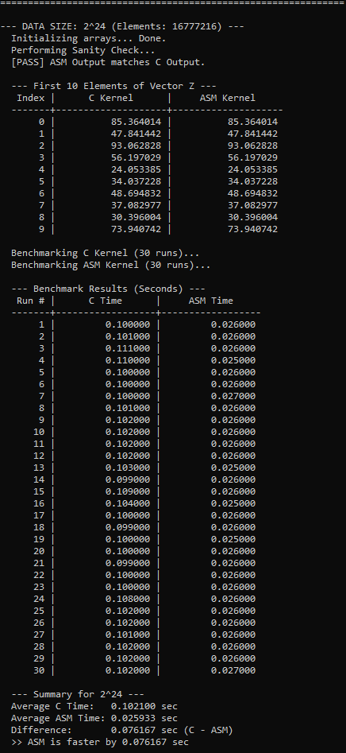
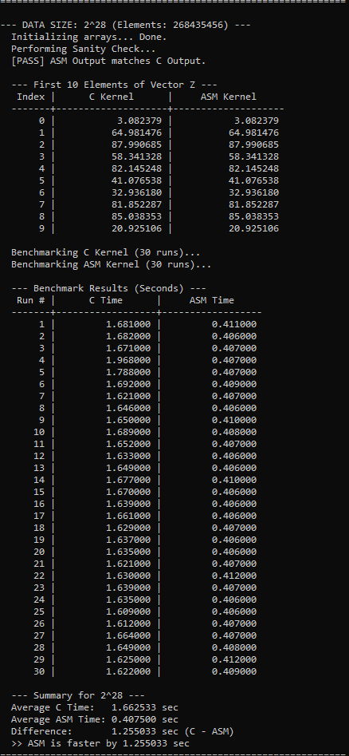

# LBYARCH_MCO2

## I. Comparative Execution Time and Short Analysis of the Performance of the Kernels

| Data Size | Average C Time | Average x86-64 Time | Difference (C - x86-64) |
| :--- | :--- | :--- | :--- |
| $2^{20}$ | 0.007033 sec | 0.001633 sec | 0.005400 sec |
| $2^{24}$ | 0.102100 sec | 0.025933 sec | 0.076167 sec |
| $2^{28}$ | 1.662533 sec | 0.407500 sec | 1.255033 sec |

The x86-64 implementation is consistently 4 times faster than the C implementation. While the ratio of improvement (4x) remains constant, the time saved grows with the data size.

## II. and III. Screenshots of the Program Output w/ Correctness Check (C and x86-64)

Data Size: 2^20:

Data Size: 2^24:

Data Size: 2^28:

## IV. Video

https://drive.google.com/file/d/1O1m0A5C-Y2bsqCNMAh5L5pS0AFvLIBum/view?usp=sharing